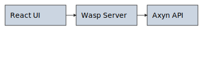

# Norian


**Norian** is the front-end layer of the Axyn.ai system, designed as a modular interface for managing agents, memory, personalities, and tools.


## Quickstart

```bash
# Install the Wasp CLI (required for development and E2E tests)
curl -sSL https://get.wasp.sh/installer.sh | sh
# or use npm:
npm install -g @wasp/cli

# (Optional) create a starter SaaS project
wasp new -t saas
```

Then clone this repo and run `wasp start` inside the project directory.
---

## 🔧 Stack Overview

- **Wasp Framework** (React + Node.js + Prisma)
- **TypeScript** frontend with TailwindCSS
- **FastAPI** backend router (CortexForge, MindForge, etc.)
- **MariaDB** for structured data
- **Qdrant** for vector memory search

---

## 📁 Project Structure

```
norian/
├── src/
│   ├── components/ # Shared UI elements
│   ├── pages/      # Route-based views
│   └── styles/     # Global Tailwind setup
├── main.wasp       # Wasp configuration
├── package.json    # Project dependencies
└── README.md       # This file
```




---

## 🚀 Getting Started

```bash
# Install the Wasp CLI (needed for dev server and E2E tests)
curl -sSL https://get.wasp.sh/installer.sh | sh
# or: npm install -g @wasp/cli

# (Optional) create a new SaaS project
wasp new -t saas

# Clone this repo
git clone https://github.com/ryanswalters/Norian.git
cd Norian

# Install dependencies
npm install

# Start development server
wasp start
```

For convenience, run `scripts/setup-dev.sh` to install dependencies and set up the database. The script automatically verifies that **Node.js 18+** is installed and that the current directory is writable before attempting to install packages. It fails early with a clear error message if the requirements aren't met or if packages can't be fetched (for example when network access is disabled).
The script also checks for the Wasp CLI and ensures that Vitest is installed so tests can run locally.

Once the server is running, open [http://localhost:3000/preview](http://localhost:3000/preview) to confirm that the backend is live and test agent replies in real time.

If the setup script stops:
1. Check that your Node.js version is 18 or higher (`node -v`).
2. Ensure the project directory is writable by the current user.
3. Confirm the environment has internet access or a local npm cache.

`scripts/dev_bootstrap.sh` is still available to automate a full start of the development server after setup.

See `docs/first_run.md` for a detailed first-time setup walkthrough.

Note: Wasp will auto-link the backend and generate Prisma models on build.

## 📦 Features

| Module           | Description                                        |
| ---------------- | -------------------------------------------------- |
| MindForge        | Memory engine (vector + structured)                |
| PersonalityForge | Style, tone, and personality routing               |
| SynapseForge     | Plugin architecture for tools + extensions         |
| CortexForge      | Main API router (FastAPI backend)                  |
| Sentinel         | Pattern monitor and proactive triggers             |
| Live Preview     | Real-time agent and memory test page at `/preview` |
| PreferenceForge  | Behavioral learning (food, media, habits)          |
| Tier System      | Limits features by user level or license           |

### Memory Tiers

Short → Mid → Long → Superlong

Each tier has configurable TTL. See Agents page to adjust.

For advanced memory analysis tools, see `docs/diagnostics.md`.

## 📄 Docs Status

| File                    | Status      |
| ----------------------- | ----------- |
| codex/GETTING_STARTED.md | Setup guide |
| codex/TASKS.md           | Task list |
| codex/AGENTS.md          | Agent docs |
| docs/diagnostics.md      | Memory tools |

When added, Codex will automatically read and follow those markdown guides.

## 🧠 Axyn.ai System Integration

Norian is the official frontend for:

- Memory recall + structured journal
- Multi-personality agent management
- Plugin loading + task delegation
- Memory export/import system
- Tier-based quota enforcement

## Known Issues

Tests and coverage reports require internet access to install dev dependencies.
In restricted environments (e.g., air-gapped CI or devcontainers without
network), run `scripts/setup-dev.sh` on a machine with internet first, or
manually install the packages listed in `package.json`. After dependencies are
installed you can run `npm test` and `npm run coverage` locally.
The Wasp CLI must also be installed globally for end-to-end tests. If global
package installation is blocked, perform the setup on a machine with internet
access and copy the environment afterward.
End-to-end tests are implemented with Playwright. `npm run e2e` will start the
backend automatically if needed, but you can also run `wasp start` in another
terminal and then execute the command. If the tests fail immediately, ensure the
backend is running on `localhost:3000`.
If you are unsure whether the backend is reachable, open `/preview` in the
browser. It displays the current backend status and lets you try a quick
prompt.
Setup may also fail if your Node.js version is below 18 or if you lack write
permissions in the project directory. Check these first if the script exits
early.

### Troubleshooting E2E

If `npm run e2e` exits immediately or fails to connect, confirm that `wasp start`
works in another terminal and that port `3000` is free. The runner writes backend
output to `e2e-backend.log`. Check that file for errors and try starting the
backend manually if the log shows a failure. Visiting `/preview` should display a
green "live" indicator when the backend is reachable.
If the command complains that `wasp` cannot be found, install the Wasp CLI with
`curl -sSL https://get.wasp.sh/installer.sh | sh` or `npm install -g @wasp/cli`.
See `docs/first_run.md` for details.

## 🛡 License

## 🛡 License

- Free for personal and educational use
- Commercial use requires license (contact the Axyn.ai team)

## 🧠 What’s Next?

You can:

- Build out codex/GETTING_STARTED.md for Codex onboarding
- Inject the Persona Picker UI
- Add /store, /agents, /memory, and /dashboard routes
- Connect Norian to a live CortexForge API backend

